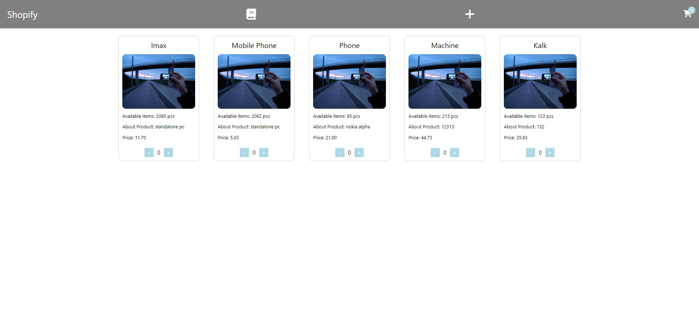
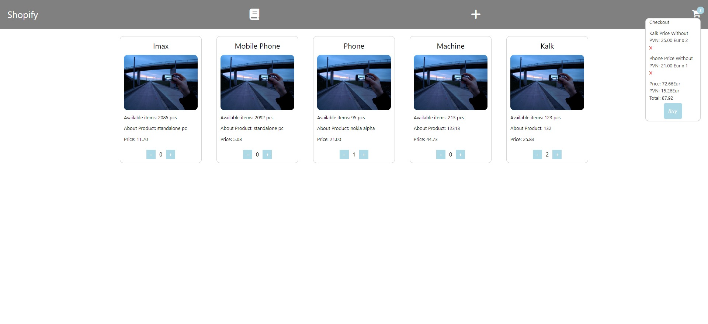
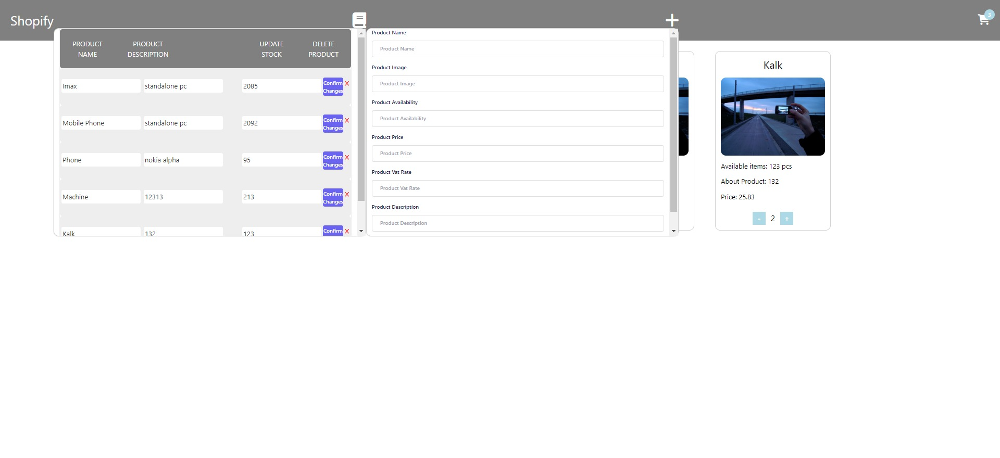

# Arkbauer PHP test task

### E-commerce cart

### Created with PHP 8.0/Vue.js/Axios/PHPUnit

### Create Remove Update Delete, Cart App

-----

-----

-----

-----

# How To Set up:

### ! Requirements:

#### PHP installed on your machine

#### MySql database

----

#### 1. Clone this git repository or download to your chosen directory

#### 2 . Create database in your mysql and import from arkbauer.sql in root folder to your mysql created database.

#### 3.  Edit mysql database detail fields in file src/config/config.php:
##### a. $username;
##### b. $password;
##### c. $host;
##### d. $databaseName;

#### 3. Run command to install required packages

~~~~

composer install

~~~~

### 5. Run with command

~~~~

php -S localhost:8000

~~~~

----
